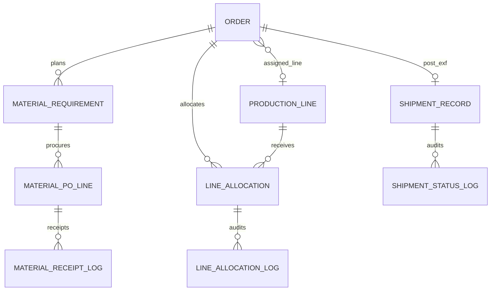
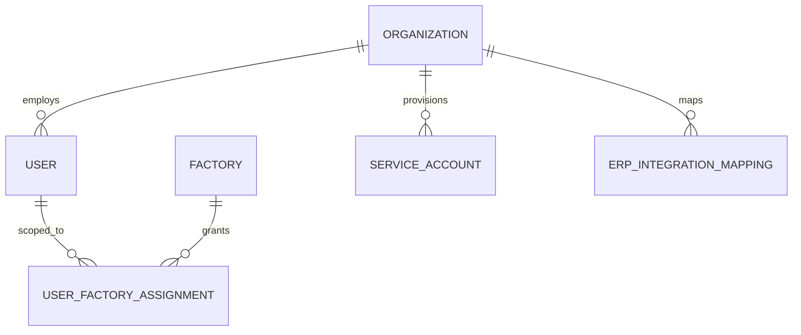

# FactoryFlow — Database Architecture & Data Model Specification

> **Status:** Locked — Draft v1  
> **Baseline:** Locked PRD Modules 1–7 (`PRD-MVP.md`); Locked Platform Architecture Addendum (`Platform-Architecture-Addendum.md`)  
> **Locked:** Database Architecture & Data Model Specification v1 complete  
> **Purpose:** Transform functional architecture into a complete database design  
> **Scope:** Architecture and data model only — **no SQL** (DDL deferred post-lock)

---

## Project documentation status

| Document | Status |
|---|---|
| PRD-MVP.md — Modules 1–7 | Locked |
| Platform Architecture Addendum | Locked — Draft v1 |
| **This document** | **Locked — Draft v1** |

**Design phase:** Functional architecture (Modules 1–7), platform layer, and physical data model are locked. Next artifact: SQL DDL / migration scripts (post-lock).

## Document relationship

| Document | Role |
|---|---|
| **PRD-MVP.md** | Authoritative for entity semantics, business rules, and module field definitions |
| **Platform Architecture Addendum** | Authoritative for platform entities, API ownership, tenancy, integration |
| **This document** | Physical data model: tables, keys, relationships, indexes, storage strategy |

Business rules (engine behavior, state machines, workflows) are **not** redefined here — only how state is persisted and queried.

---

## 1. Data architecture principles

| # | Principle | Source |
|---|---|---|
| 1 | **Single database, logical domains** — one PostgreSQL cluster per environment; bounded contexts grouped by schema prefix or naming, not separate databases in V1.1 | Platform |
| 2 | **Tenant-first** — every business row carries `organization_id`; all queries filter by authenticated tenant | Platform §2, §4 |
| 3 | **SSOT per domain** — no duplicate milestone, KPI, or procurement state stores | PRD §2.7 |
| 4 | **Order-scoped synchronous core** — TNA save + engine + KPI cache + Timeline + RiskSignal in one transaction | PRD §2.4, §2.7 |
| 5 | **Append-only audit** — Timeline, module logs, config audit, integration idempotency — no destructive history | PRD §2.3, Platform §12 |
| 6 | **UUID primary keys** — all entity PKs are UUID v4; external integration keys use UUID + semantic codes | PRD §2.7 |
| 7 | **Optimistic concurrency** — mutable aggregates expose integer `version`; 409 on mismatch | PRD §2.3, §5.3 |
| 8 | **Status over delete** — lifecycle termination uses enums (Archived, Cancelled, Closed) not physical delete | PRD modules |
| 9 | **Denormalize deliberately** — KPI cache on `order`, query denormalization on append logs — never alternate SSOT | PRD §2.3 |
| 10 | **Reserved schema** — future entities created empty or nullable; no migration-breaking renames | PRD §2.8 |

---

## 2. Entity inventory

### 2.1 Platform & identity

| Entity | Table (proposed) | Release |
|---|---|---|
| Organization | `organization` | V1 |
| User | `user` | V1 |
| UserRole | `user_role` | V1 |
| UserFactoryAssignment | `user_factory_assignment` | V1.1 |
| ServiceAccount | `service_account` | V1.1 |
| ServiceAccountRole | `service_account_role` | V1.1 |
| OrganizationPlatformSettings | `organization_platform_settings` | V1.1 |

### 2.2 Integration

| Entity | Table | Release |
|---|---|---|
| ErpIntegrationMapping | `erp_integration_mapping` | V1.1 |
| IntegrationIdempotencyRecord | `integration_idempotency_record` | V1.1 |
| IntegrationCredentialRef | `integration_credential_ref` | V1.1 |
| OutboxEvent | `outbox_event` | V1.1 |

### 2.3 Module 1 — Order Command Center

| Entity | Table | Release |
|---|---|---|
| Factory | `factory` | V1 |
| ProductionStage | `production_stage` | V1 |
| ProductionStageWeight | `production_stage_weight` | V1 |
| SizeScale | `size_scale` | V1 |
| SizeScaleSize | `size_scale_size` | V1 |
| Order | `order` | V1 |
| Style | `style` | V1 |
| Colorway | `colorway` | V1 |
| SizeBreakdown | `size_breakdown` | V1 |
| ProductionProgress | `production_progress` | V1 |
| QuickNote | `quick_note` | V1 |
| TimelineEvent | `timeline_event` | V1 |
| OrderAttachment | `order_attachment` | V1 |
| RiskSignal | `risk_signal` | V1 |

### 2.4 Module 2 — Critical Path & TNA

| Entity | Table | Release |
|---|---|---|
| OrganizationTnaSettings | `organization_tna_settings` | V1 |
| TNAGateLibraryItem | `tna_gate_library_item` | V1 |
| TNATemplate | `tna_template` | V1 |
| TNATemplateVersion | `tna_template_version` | V1 |
| TNATemplateItem | `tna_template_item` | V1 |
| TNATemplateWeightRevision | `tna_template_weight_revision` | V1 |
| TNARevisionReason | `tna_revision_reason` | V1 |
| TNAItem | `tna_item` | V1 |
| TNAItemDateRevision | `tna_item_date_revision` | V1 |
| OrgConfigAuditLog | `org_config_audit_log` | V1 |

**Reference / registry (seeded):** `tna_phase`, `tna_display_group`, `tna_item_type` — small lookup tables.

### 2.5 Module 3 — Planner Dashboard

| Entity | Table | Release |
|---|---|---|
| DashboardSavedView | `dashboard_saved_view` | V1.1 |
| DashboardSession | `dashboard_session` | V1.1 |
| DashboardWidgetConfig | `dashboard_widget_config` | V1.1 (optional) |

### 2.6 Module 4 — Material Planning

| Entity | Table | Release |
|---|---|---|
| OrganizationMaterialSettings | `organization_material_settings` | V1.1 |
| MaterialRequirement | `material_requirement` | V1.1 |
| MaterialPOLine | `material_po_line` | V1.1 |
| MaterialReceiptLog | `material_receipt_log` | V1.1 |
| MaterialReconciliationQueueItem | `material_reconciliation_queue_item` | V1.1 |

### 2.7 Module 5 — Capacity Planning

| Entity | Table | Release |
|---|---|---|
| OrganizationCapacitySettings | `organization_capacity_settings` | V1.1 |
| ProductionLine | `production_line` | V1.1 |
| LineCapacityProfile | `line_capacity_profile` | V1.1 |
| LineAllocation | `line_allocation` | V1.1 |
| LineAllocationLog | `line_allocation_log` | V1.1 |
| CapacityReconciliationQueueItem | `capacity_reconciliation_queue_item` | V1.1 |

### 2.8 Module 6 — Shipment Tracking

| Entity | Table | Release |
|---|---|---|
| OrganizationShipmentSettings | `organization_shipment_settings` | V1.1 |
| ShipmentRecord | `shipment_record` | V1.1 |
| ShipmentStatusLog | `shipment_status_log` | V1.1 |
| ShipmentDocumentLink | `shipment_document_link` | V1.1 |
| ShipmentReconciliationQueueItem | `shipment_reconciliation_queue_item` | V1.1 |

### 2.9 Module 7 — Reporting

| Entity | Table | Release |
|---|---|---|
| OrganizationReportingSettings | `organization_reporting_settings` | V1.1 |
| ReportDefinition | `report_definition` | V1.1 |
| ReportRun | `report_run` | V1.1 |
| ExportJob | `export_job` | V1.1 |
| ExportArtifact | `export_artifact` | V1.1 |

### 2.10 Entity count summary

| Domain | Tables (V1) | Tables (V1.1 add) | Total |
|---|---|---|---|
| Platform | 3 | 8 | 11 |
| Module 1 | 14 | 0 | 14 |
| Module 2 | 10 + 3 lookup | 0 | 13 |
| Module 3 | 0 | 3 | 3 |
| Module 4 | 0 | 5 | 5 |
| Module 5 | 0 | 6 | 6 |
| Module 6 | 0 | 5 | 5 |
| Module 7 | 0 | 5 | 5 |
| **Approximate total** | **~30** | **~32** | **~62** |

---

## 3. Domain boundaries

```
┌─────────────────────────────────────────────────────────────────────────┐
│ PLATFORM SCHEMA                                                        │
│ organization · user · user_factory_assignment · service_account        │
│ integration_* · outbox_event · organization_platform_settings          │
└───────────────────────────────┬─────────────────────────────────────────┘
                                │
        ┌───────────────────────┼───────────────────────┐
        ▼                       ▼                       ▼
┌───────────────┐     ┌─────────────────┐     ┌─────────────────┐
│ ORDER (M1)    │     │ TNA CONFIG (M2) │     │ EXPERIENCE      │
│ order aggregate│◄───│ tna_item (M2)   │     │ dashboard (M3)  │
│ timeline      │     │ templates/lib   │     │ reporting (M7)  │
│ risk_signal*  │     │ org_tna_settings│     └─────────────────┘
└───────┬───────┘     └────────┬────────┘
        │                      │
        │    ┌─────────────────┼─────────────────┐
        │    ▼                 ▼                 ▼
        │  MATERIAL (M4)   CAPACITY (M5)   SHIPMENT (M6)
        │  po_line         line_allocation  shipment_record
        └────────────────── (all FK → order.id)
```

**Boundary rules:**

| Boundary | May read | May write |
|---|---|---|
| Platform → all | Tenant metadata | IAM, integration, outbox only |
| Module 2 engine → M1 store | — | `timeline_event`, `risk_signal`, KPI columns on `order` |
| Module 4/5/6 → Module 2 | `tna_item` | Via Module 2 API only — not direct row update in app layer |
| Module 7 → all | Read APIs | `report_*`, `export_*` only |

---

## 4. Entity ownership

Aligned with locked PRD §2.7 ownership matrix and Platform Appendix A. **Logical owner** defines business authority; **physical location** is the table; **write authority** is the only permitted writer.

### 4.1 Module 1 — Order Command Center

| Entity / store | Logical owner | Physical location | Write authority | Consumers (read) |
|---|---|---|---|---|
| Order header (PO, buyer, style, Order Type) | Module 1 | `order` | Module 1 | M2, M3, M4, M5, M6, M7 |
| Order manual overrides (On Hold, Cancelled, Closed) | Module 1 | `order` | Module 1 | M2 engine (same transaction on override save) |
| Style, Colorway, SizeBreakdown hierarchy | Module 1 | `style`, `colorway`, `size_breakdown` | Module 1 | M1, M5 (load units) |
| Overall Progress (qty by stage) | Module 1 | `production_progress` | Module 1 | M2 UX strip (read mirror only) |
| Quick Notes | Module 1 | `quick_note` | Module 1 | M1 |
| Order Documents | Module 1 | `order_attachment` | Module 1 | M6 (V1.1 links) |
| Factory, ProductionStage, SizeScale | Module 1 | respective tables | Module 1 / Org Admin | All modules |
| ProductionStageWeight | Module 1 | `production_stage_weight` | Org Admin via M1 settings | M1 Overall Progress |
| KPI cache (CP Progress, Risk Level, summary status, etc.) | Module 2 engine | `order` (KPI columns) | M2 engine (step 7) only | M1, M3, M7 — derived; never write |
| `assigned_production_line_id` | Module 1 Order field | `order` | M5 via Module 1 PATCH on Confirm/Deallocate | M1, M5 |

### 4.2 Module 2 — Critical Path & TNA

| Entity / store | Logical owner | Physical location | Write authority | Consumers (read) |
|---|---|---|---|---|
| TNA instance state | Module 2 | `tna_item` | Module 2 only (M4/M5/ERP via M2 API) | M1, M3, M4, M5, M6, ERP |
| `is_complete` (engine-derived) | Module 2 engine | `tna_item` | M2 engine (step 2) only | M3, M7 portfolio queries |
| TNA templates & gate library | Module 2 org config | `tna_*` config tables | Org Admin | M2 instantiation |
| OrganizationTnaSettings | Module 2 | `organization_tna_settings` | Org Admin | Engine, M3, M5, M6 |
| TNAItemDateRevision | Module 2 | `tna_item_date_revision` | M2 engine (append) | M7 GATE_SLIPPAGE |
| OrgConfigAuditLog | Module 2 / Platform | `org_config_audit_log` | Org Admin mutations | Admin |

### 4.3 Module 1 store / Module 2 engine (shared boundary)

| Entity / store | Logical owner | Physical location | Write authority | Consumers (read) |
|---|---|---|---|---|
| RiskSignal | Module 2 Risk Engine | `risk_signal` | M2 engine only (step 3) | M1, M3, M7 — derived; never write |
| Production Timeline | Module 1 store / M2 writer | `timeline_event` | M2 engine (TNA + override events); M1 (Quick Notes) | M1, M3, M7, ERP |

### 4.4 Module 3 — Planner Dashboard

| Entity / store | Logical owner | Physical location | Write authority | Consumers (read) |
|---|---|---|---|---|
| DashboardSavedView, DashboardSession, DashboardWidgetConfig | Module 3 | respective tables | Module 3 | M3 UI only — no production planning state |

### 4.5 Module 4 — Material Planning

| Entity / store | Logical owner | Physical location | Write authority | Consumers (read) |
|---|---|---|---|---|
| MaterialRequirement | Module 4 | `material_requirement` | Module 4 | M4, M7 |
| MaterialPOLine (line-level qty SSOT) | Module 4 | `material_po_line` | Module 4 | M3 widget, M4, M7 |
| MaterialReceiptLog | Module 4 | `material_receipt_log` | Module 4 (append) | M4 admin, ERP reconciliation |
| OrganizationMaterialSettings | Module 4 | `organization_material_settings` | Org Admin | M4 |
| Material gate qty/status on TNA | Module 2 TNAItem | `tna_item` | Module 4 via M2 material transition API only | M1, M3, M4 |
| MaterialReconciliationQueueItem | Module 4 | `material_reconciliation_queue_item` | Module 4 (+ platform resolution audit) | M4 admin queue |

### 4.6 Module 5 — Capacity Planning

| Entity / store | Logical owner | Physical location | Write authority | Consumers (read) |
|---|---|---|---|---|
| ProductionLine, LineCapacityProfile | Module 5 | respective tables | Module 5 admin | M5, M3, M7 |
| LineAllocation | Module 5 | `line_allocation` | Module 5 | M5, M3 |
| LineAllocationLog | Module 5 | `line_allocation_log` | Module 5 (append; Confirm log after saga success) | M5 admin |
| OrganizationCapacitySettings | Module 5 | `organization_capacity_settings` | Org Admin | M5 |
| SLA gate completion on TNA | Module 2 TNAItem | `tna_item` | Module 5 via M2 API on Confirm saga only | M1, M3, M5 |
| CapacityReconciliationQueueItem | Module 5 | `capacity_reconciliation_queue_item` | Module 5 (+ platform resolution audit) | M5 admin queue |

### 4.7 Module 6 — Shipment Tracking

| Entity / store | Logical owner | Physical location | Write authority | Consumers (read) |
|---|---|---|---|---|
| ShipmentRecord (post-EXF logistics SSOT) | Module 6 | `shipment_record` | Module 6 | M3, M6, M7 |
| ShipmentStatusLog | Module 6 | `shipment_status_log` | Module 6 (append) | M6 admin |
| ShipmentDocumentLink | Module 6 | `shipment_document_link` | Module 6 | M6 — pointers to M1 attachments |
| OrganizationShipmentSettings | Module 6 | `organization_shipment_settings` | Org Admin | M6 |
| EXF gate state | Module 2 TNAItem | `tna_item` | Module 2 only | M6 (read for activation seed) |
| ShipmentReconciliationQueueItem | Module 6 | `shipment_reconciliation_queue_item` | Module 6 (+ platform resolution audit) | M6 admin queue |

### 4.8 Module 7 — Reporting

| Entity / store | Logical owner | Physical location | Write authority | Consumers (read) |
|---|---|---|---|---|
| ReportDefinition, ReportRun, ExportJob, ExportArtifact | Module 7 | respective tables | Module 7 | M7 UI, ERP pickup |
| OrganizationReportingSettings | Module 7 | `organization_reporting_settings` | Org Admin | M7 |
| KPI / TNA / module data in reports | Respective SSOT modules | Producer APIs | **Read only** — M7 orchestrates; no parallel stores | M7 |

### 4.9 Platform

| Entity / store | Logical owner | Physical location | Write authority | Consumers (read) |
|---|---|---|---|---|
| Organization, User, UserRole | Platform | platform tables | Platform IAM | All |
| UserFactoryAssignment | Platform | `user_factory_assignment` | Org Admin | Portfolio scope filter |
| ServiceAccount, ServiceAccountRole | Platform | platform tables | Org Admin | Integration gateway |
| ErpIntegrationMapping | Platform | `erp_integration_mapping` | Org Admin | M7 ERP export, gateway |
| IntegrationIdempotencyRecord | Platform | `integration_idempotency_record` | Integration gateway | Gateway replay |
| IntegrationCredentialRef | Platform | `integration_credential_ref` | Org Admin | Gateway |
| OutboxEvent | Platform | `outbox_event` | Platform outbox worker | ERP, async consumers |
| OrganizationPlatformSettings | Platform | `organization_platform_settings` | Org Admin | Platform routing |

---

## 5. ER model

### 5.1 Core order + TNA (V1)

```mermaid
erDiagram
    ORGANIZATION ||--o{ FACTORY : has
    ORGANIZATION ||--|| ORGANIZATION_TNA_SETTINGS : has
    FACTORY ||--o{ ORDER : places
    ORDER ||--o{ STYLE : contains
    STYLE ||--o{ COLORWAY : contains
    COLORWAY ||--o{ SIZE_BREAKDOWN : contains
    ORDER ||--o{ TNA_ITEM : instantiates
    ORDER ||--o{ TIMELINE_EVENT : audits
    ORDER ||--o{ RISK_SIGNAL : derives
    ORDER ||--o{ QUICK_NOTE : has
    ORDER ||--o{ ORDER_ATTACHMENT : has
    ORDER }o--|| TNA_TEMPLATE_VERSION : frozen_at_create
    TNA_ITEM ||--o{ TNA_ITEM_DATE_REVISION : revises
    TNA_ITEM }o--o| TNA_ITEM : hard_gate_predecessor
    TNAT_TEMPLATE ||--o{ TNA_TEMPLATE_VERSION : versions
    TNA_TEMPLATE_VERSION ||--o{ TNA_TEMPLATE_ITEM : composes
    TNA_GATE_LIBRARY_ITEM ||--o{ TNA_TEMPLATE_ITEM : references
```

### 5.2 V1.1 extension (material, capacity, shipment)



### 5.3 Platform tenancy



---

## 6. Relationships

### 6.1 Cardinality rules

| Relationship | Cardinality | Rule |
|---|---|---|
| Organization → Order | 1:N | Hard tenant boundary |
| Order → TNAItem | 1:N | One TNA per order in V1 (`TNAItemScope = Order`) |
| Order → ShipmentRecord | 1:0..1 active | Max one Active record V1.1 |
| Order → LineAllocation | 1:N | Multiple Draft/Archived; at most one Confirmed; at most one Draft **or** ConfirmPending at a time (M5 §5.3) |
| MaterialRequirement → MaterialPOLine | 1:N | Multiple PO lines per requirement |
| MaterialPOLine → TNAItem | N:1 | BFO/BTO ordered gate via `tna_item_uuid` |
| TNAItem → TNAItem (predecessor) | N:1 | Single `hard_gate_predecessor_id` in V1 |
| TNATemplateVersion → Order | 1:N | Frozen on `order.tna_template_version_id` |
| ExportJob → ExportArtifact | 1:N | Scheduled snapshots |
| ReportRun → ExportArtifact | 1:0..1 | Ad-hoc export |

### 6.2 Cross-module FK discipline

| FK | Enforced |
|---|---|
| All module tables → `organization_id` | Yes — composite indexes with tenant |
| `material_*`, `line_*`, `shipment_*` → `order_id` | Yes |
| `tna_item_uuid` references | UUID immutable — no FK to serial id |
| `assigned_production_line_id` → `production_line.id` | Yes — Module 1 column, Module 5 orchestrates |
| `order_attachment_id` in shipment link | Yes — no file duplication |

### 6.3 Non-FK logical links

| Link | Mechanism |
|---|---|
| TNAItem ↔ MaterialPOLine | `tna_item_uuid` + gate code |
| Domain events | `event_id`, `correlation_id` — not relational FK |
| Export artifact blob | `storage_key` → object store |

---

## 7. Primary keys

| Rule | Detail |
|---|---|
| **Type** | UUID v4 for all entity PKs |
| **Generation** | Application-generated before insert |
| **Immutable business keys** | `TNAItem.uuid` assigned at instantiation — never changes |
| **Semantic keys** | Milestone Code, `line_code`, `report_code` — unique per org, not PK |
| **Surrogate only** | No auto-increment integers exposed to API |

### 7.1 Special identifiers

| Field | Role |
|---|---|
| `TNAItem.uuid` | External integration primary key for milestones |
| `ExportArtifact.id` | Also `source_event_id` for ERP outbound |
| `OrderExFactoryCompleted.event_id` | Shipment activation idempotency |
| `activation_event_id` on `shipment_record` | Dedup post-commit handler |

---

## 8. Foreign keys

### 8.1 Standard FK columns

| Column | Targets | On delete |
|---|---|---|
| `organization_id` | `organization.id` | RESTRICT |
| `order_id` | `order.id` | RESTRICT (Cancel/Close is status, not delete) |
| `factory_id` | `factory.id` | RESTRICT |
| `tna_template_version_id` | `tna_template_version.id` | RESTRICT |
| `production_line_id` | `production_line.id` | RESTRICT |
| `material_requirement_id` | `material_requirement.id` | RESTRICT |
| `shipment_record_id` | `shipment_record.id` | RESTRICT |

### 8.2 Self-referential

| Table | Column | Purpose |
|---|---|---|
| `tna_item` | `hard_gate_predecessor_id` → `tna_item.id` | V1 single predecessor |
| `tna_item` | `source_tna_item_id` (copy TNA) | Provenance — optional |

### 8.3 Nullable integration FKs (V1.1+)

| Column | Note |
|---|---|
| `order.external_reference` | ERP header — no FK |
| `tna_item.external_reference` | ERP doc — no FK |
| `production_line.external_reference` | SAP work center — no FK |

### 8.4 FK indexing

Every FK column gets a supporting index — preferably **composite** `(organization_id, fk_column)` for tenant-scoped joins.

---

## 9. Unique constraints

| Table | Unique constraint | Purpose |
|---|---|---|
| `organization` | `slug` or external tenant key | Login routing |
| `user` | `(organization_id, email)` | Login uniqueness |
| `user_factory_assignment` | `(organization_id, user_id, factory_id)` | Platform §4.2 |
| `service_account` | `(organization_id, name)` | Admin clarity |
| `tna_gate_library_item` | `(organization_id, milestone_code)` | Immutable code |
| `tna_item` | `(organization_id, uuid)` | Integration SSOT |
| `tna_item` | `(order_id, milestone_code)` | One code per order instance |
| `production_line` | `(organization_id, line_code)` when not null | M5 §5.3 |
| `risk_signal` | `(order_id, signal_id, tna_item_uuid)` active partial unique | One active row per tuple |
| `integration_idempotency_record` | `(organization_id, source_system, source_event_id)` | Platform §6.4 |
| `shipment_record` | `(organization_id, order_id, activation_event_id)` | M6 idempotency |
| `report_definition` | `(organization_id, report_code)` | Catalog key |
| `erp_integration_mapping` | `(organization_id, factory_id, external_plant_reference)` | Plant mapping |
| `material_po_line` | `(organization_id, order_id, po_reference, line_seq)` | PO line identity — `line_seq` assigned sequentially per PO reference at create (starts at 1) |

### 9.1 Partial unique indexes

| Table | Condition | Purpose |
|---|---|---|
| `line_allocation` | `status = 'Confirmed'` per `(organization_id, order_id)` | One confirmed allocation V1.1 (M5 §5.3) |
| `line_allocation` | `status IN ('Draft', 'ConfirmPending')` per `(organization_id, order_id)` | One in-flight allocation per order (M5 §5.3) |
| `shipment_record` | `status NOT IN ('Archived')` per `(organization_id, order_id)` | One active shipment |
| `risk_signal` | `deactivated_at IS NULL` | Active signal uniqueness |

### 9.2 Material PO line identity

| Field | Rule |
|---|---|
| `line_seq` | Required integer; assigned at PO line create; monotonic per `(organization_id, order_id, po_reference)` starting at 1 |
| Integration key | `material_po_line.id` (UUID) is the authoritative integration reference; `po_reference` + `line_seq` is the human/SAP line identity within an order |
| SAP alignment | `material_document_reference` on the PO line holds authoritative MM doc ID; `line_seq` maps to EKPO line position within a PO reference group |

---

## 10. Versioning strategy

### 10.1 Optimistic concurrency (mutable rows)

| Table | Column | Writer |
|---|---|---|
| `order` | `version` | Module 1, Module 5 PATCH |
| `tna_item` | `version` | Module 2 |
| `material_requirement` | `version` | Module 4 |
| `material_po_line` | `version` | Module 4 |
| `production_line` | `version` | Module 5 admin |
| `line_allocation` | `version` | Module 5 |
| `shipment_record` | `version` | Module 6 |

**Rule:** API requires `expected_version`; increment on every successful update.

### 10.2 Template versioning (instantiation-frozen)

| Layer | Versioning |
|---|---|
| `tna_template_version` | Monotonic version per template; publish creates immutable snapshot |
| `order.tna_template_version_id` | Set at order create — never updated |
| Library edits | Do not mutate published template versions |

### 10.3 Business rule versioning (derived data)

| Field | Location | Behavior |
|---|---|---|
| `is_complete` | `tna_item` | Engine-computed completion predicate (PRD §2.3); **persisted** on each Standard Engine Execution step 2 — atomic with type-specific status fields; not client-writable |
| `business_rule_version` | `order` KPI cache | Set each engine run from app constant `"2.3"` |
| `calculated_at` | `order` KPI cache | Set each engine run — atomic with KPI fields |
| `business_rule_version` | `report_run` | Dominant version in result set — audit only |

### 10.4 Append-only versioning

No version column — immutability by policy:

- `timeline_event`, `tna_item_date_revision`, `material_receipt_log`, `line_allocation_log`, `shipment_status_log`, `org_config_audit_log`

Corrections via compensating append events (PRD §2.3).

### 10.5 Engine / export schema versioning

| Artifact | Version field |
|---|---|
| Domain event envelope | `schema_version` = `"1.0"` |
| ERP export JSON | `export_schema_version` = `"7.1"` |
| Capacity engine metadata | `capacity_engine_version` = `"5.5"` |
| Report engine metadata | `report_engine_version` = `"7.5"` |

---

## 11. Soft delete strategy

FactoryFlow **does not use** generic `deleted_at` columns. Lifecycle is expressed through **status enums** and **archival**.

| Pattern | Tables | Mechanism |
|---|---|---|
| **Terminal order state** | `order` | `cancelled_at`, `closed_at`, `on_hold_at` flags — not delete |
| **Archived allocation** | `line_allocation` | `status = Archived` |
| **Archived PO line** | `material_po_line` | `archived_at` + status |
| **Archived shipment** | `shipment_record` | `status = Archived` |
| **Archived library gate** | `tna_gate_library_item` | `status = Archived` — terminal |
| **Hidden report** | `report_definition` | `is_hidden = true` |
| **Revoked credentials** | `service_account` | `status = Revoked` |
| **Inactive line** | `production_line` | `status = Inactive` |

**Physical delete:** Prohibited for audit-bearing entities. Org offboarding → tenant export + cold storage — future platform process.

---

## 12. Audit strategy

### 12.1 Audit tiers

| Tier | Store | Mutability | Consumer |
|---|---|---|---|
| **Production Timeline** | `timeline_event` | Append-only | Planners, M7 activity reports |
| **Structured revisions** | `tna_item_date_revision` | Append-only | M7 GATE_SLIPPAGE |
| **Risk lifecycle** | `risk_signal` | Deactivate-then-activate per engine run | M1, M3, M7 |
| **Module append logs** | `material_receipt_log`, `line_allocation_log`, `shipment_status_log` | Append-only | Module admin, ERP reconciliation |
| **Org config audit** | `org_config_audit_log` | Append-only | Org Admin |
| **Platform audit** | `platform_audit_log` (proposed) | Append-only | IAM, integration |
| **Integration idempotency** | `integration_idempotency_record` | Insert + cached replay | Gateway |

### 12.2 Required audit fields (append logs)

| Field | Purpose |
|---|---|
| `organization_id` | Tenant |
| `user_id` or `actor_service_id` | Actor |
| `source_module` | Originating module enum |
| `correlation_id` | Cross-module trace |
| `created_at` | Immutable timestamp |
| `payload` (JSON) | Before/after or action context |

### 12.3 Timeline vs module logs

| Event type | Store |
|---|---|
| Planner-visible production events | `timeline_event` (Module 2 engine writer) |
| Procurement receipt detail | `material_receipt_log` (parallel, not replacement) |
| Logistics status changes | `shipment_status_log` (parallel) |

---

## 13. Index strategy

### 13.1 Universal indexes

| Pattern | Tables |
|---|---|
| `(organization_id)` | All tenant tables |
| `(organization_id, id)` | PK lookups with tenant guard |

### 13.2 Portfolio / cross-order queries (Module 3, Module 7)

From PRD §3.6 and Platform §9 — **required for V1.1**. Column names match locked PRD field semantics (API camelCase → DB snake_case).

| Index | Supports |
|---|---|
| `(organization_id, factory_id, summary_status)` on `order` | Active portfolio filters |
| `(organization_id, risk_level, days_to_ex_factory)` on `order` | At Risk, meeting queue sort |
| `(organization_id, is_complete, current_planned_date)` on `tna_item` | Due today, overdue widgets — requires persisted `is_complete` (§10.3) |
| `(organization_id, owner_type, last_chased)` on `tna_item` | Chase list — partial filter: `owner_type = External` AND `is_complete = false` |
| `(organization_id, item_type, approval_status)` on `tna_item` | Approval overdue / pending widgets (PRD §3.6) |
| `(organization_id, milestone_code, is_complete)` on `tna_item` | EXF horizon, SLA widget |
| `(organization_id, occurred_at)` on `timeline_event` | Since Yesterday, PLANNER_ACTIVITY |
| `(organization_id, revision_reason_code, created_at)` on `tna_item_date_revision` | GATE_SLIPPAGE |
| `(organization_id, status)` on `shipment_record` | Post-EXF portfolio |
| `(organization_id, production_line_id, status)` on `line_allocation` | Line load |

### 13.3 FK join indexes

| Index | Purpose |
|---|---|
| `(organization_id, order_id)` on all order-child tables | Order panel loads |
| `(organization_id, tna_item_uuid)` on `material_po_line`, `line_allocation` | Gate linkage |
| `(organization_id, report_run_id)` on `export_artifact` | Download lookup |

### 13.4 Partial indexes

| Index | Filter |
|---|---|
| Active risk signals | `deactivated_at IS NULL` |
| Open reconciliation items | `resolved_at IS NULL` |
| Active shipment records | `status NOT IN ('Archived', 'Delivered')` — query dependent |
| Confirmed allocations | `status = 'Confirmed'` per `(organization_id, order_id)` |
| In-flight allocations | `status IN ('Draft', 'ConfirmPending')` per `(organization_id, order_id)` |

### 13.5 JSON indexes (optional V1.1)

| Column | Use |
|---|---|
| `order.risk_reasons` | GIN if JSONB — risk reason search (low priority) |
| `report_run.parameters` | Not indexed — run lookup by PK only |

---

## 14. Multi-tenancy strategy

### 14.1 Model

**Shared database, shared schema, row-level tenant isolation.**

| Layer | Enforcement |
|---|---|
| Application | `organization_id` from JWT on every query |
| ORM | Global tenant scope filter |
| Database | Optional RLS policies `(organization_id = current_setting('app.tenant_id'))` — recommended V1.1 |

### 14.2 Factory sub-scope

| Rule | Implementation |
|---|---|
| Human users | `user_factory_assignment` → filter `order.factory_id IN (...)` |
| Org Admin | All factories in org (implicit) |
| Service accounts | Optional `factory_ids[]` on credential |

### 14.3 Tenant provisioning

1. Create `organization` row  
2. Clone platform seed: gate library (35 items), templates (5 order types), reason codes, report definitions  
3. Create `organization_tna_settings` with defaults  
4. Create module settings rows when modules enabled  

### 14.4 Cross-tenant prohibition

No FK may span organizations. Integration records, outbox events, and artifacts are strictly tenant-scoped.

---

## 15. Partitioning considerations

### 15.1 V1.1 recommendation

**No table partitioning in V1.1** — expected scale: ≤500 factories, ≤50K active orders per org, append logs grow linearly.

### 15.2 Future candidates (V1.2+ / scale)

| Table | Strategy | Trigger |
|---|---|---|
| `timeline_event` | Range partition by `occurred_at` (monthly) | >100M rows or query SLA breach |
| `tna_item_date_revision` | Range partition by `created_at` | Reporting scan cost |
| `integration_idempotency_record` | Range partition + TTL drop | >90 day retention purge |
| `outbox_event` | Range partition by `created_at` | High event volume |

### 15.3 Object store separation

`export_artifact.storage_key` → blob storage (S3-compatible) — not DB partition. DB holds metadata only.

### 15.4 Read replicas

Portfolio queries (M3, M7) may route to read replica with **accept eventual consistency** for non-run-bound reads; report runs use `report_run_started_at` boundary (PRD §7.5).

---

## 16. Naming conventions

| Element | Convention | Example |
|---|---|---|
| Tables | `snake_case`, singular | `tna_item`, `order` |
| Columns | `snake_case` | `organization_id`, `current_planned_date` |
| Primary keys | `id` (UUID) | `id` |
| Foreign keys | `{entity}_id` | `order_id`, `factory_id` |
| UUID business key | `uuid` on `tna_item` | Distinct from PK if ever needed — V1: PK = uuid |
| Timestamps | `_at` suffix, UTC storage | `created_at`, `calculated_at` |
| Dates | `_date` suffix, date type | `exf_actual_date` |
| Enums | `SCREAMING_SNAKE` in app; lowercase in DB enum or check constraint | `ConfirmPending` |
| Indexes | `idx_{table}_{columns}` | `idx_order_org_factory_status` |
| Unique constraints | `uq_{table}_{columns}` | `uq_tna_item_order_code` |

**API ↔ DB mapping:** JSON camelCase in API; snake_case in database — translation at API boundary.

---

## 17. Database normalization decisions

### 17.1 Third normal form (default)

Configuration entities (`tna_gate_library_item`, `tna_template_*`, `production_line`) are normalized. Instance state (`tna_item`) denormalizes display names copied at instantiation (PRD §2.6 — library label changes are display-only for existing instances).

### 17.2 Intentional denormalization

| Location | Denormalized field | Reason |
|---|---|---|
| `order` | KPI cache columns | Read performance; single engine write |
| `order` | `summary_status` | Module 1 display; engine-derived |
| `line_allocation_log` | `order_id` | Query without join |
| `shipment_status_log` | `order_id` | Portfolio admin queue |
| `material_receipt_log` | cumulative qty | Point-in-time audit readability |
| `tna_item` | `milestone_code`, display name, `is_complete` | Immutable semantic key at instance; `is_complete` engine-maintained for portfolio indexes |

### 17.3 Single-table TNA item

`TNAItem` uses **single table** with type-specific columns (Standard / Approval / Material) — nullable columns per type rather than joined subtables. Aligns with PRD three-type model and engine `isComplete` predicate.

### 17.4 Reconciliation queue pattern

Module-specific queue tables extend the **Platform §11.3 base shape**. Each table remains separate (different module FKs and resolution workflows). A union view is optional for cross-module admin UI (Platform §11.4).

#### Platform base fields (required on all module queue tables)

| Column | Type | Notes |
|---|---|---|
| `id` | UUID | PK |
| `organization_id` | UUID | Tenant boundary |
| `module_code` | Enum | `M4` · `M5` · `M6` |
| `reason_code` | String | Platform catalog — Platform §11.2 |
| `order_id` | UUID | Nullable when not order-scoped |
| `status` | Enum | Open · Acknowledged · Resolved · Archived |
| `severity` | Enum | Info · Warning · Error |
| `detected_at` | Timestamp | When drift detected |
| `resolved_at` | Timestamp | Nullable |
| `resolved_by_user_id` | UUID | Nullable |

#### Module extensions and reason code mapping

Each module table adds a **module-specific `reason` enum** (locked PRD) for workflow resolution, plus a **`reason_code`** column mapped to the platform catalog:

| Module table | Module-specific `reason` (locked PRD) | Platform `reason_code` |
|---|---|---|
| `material_reconciliation_queue_item` | Gate qty ≠ PO line sum | `QTY_DIVERGENCE` |
| | ERP receipt without matching PO line | `ERP_ORPHAN_INBOUND` |
| | TNA-only receipt / local without ERP | `ERP_ORPHAN_LOCAL` |
| | Break-glass MODULE4 sync bypass | `SYNC_BYPASS` |
| `capacity_reconciliation_queue_item` | SlaWithoutAllocation | `ERP_ORPHAN_LOCAL` |
| | AllocationWithoutSla | `ERP_ORPHAN_LOCAL` |
| | AssignedLineMismatch | `QTY_DIVERGENCE` |
| | ErpOrphan | `ERP_ORPHAN_INBOUND` |
| | Confirm saga partial failure (stale ConfirmPending) | `SAGA_INCOMPLETE` |
| `shipment_reconciliation_queue_item` | ExfWithoutRecord | `EXF_WITHOUT_RECORD` |
| | RecordWithoutExf | `RECORD_WITHOUT_EXF` |
| | StatusDrift / lifecycle drift | `SYNC_BYPASS` |
| | ExfReopenedWithActiveShipment | `RECORD_WITHOUT_EXF` |
| | OrderCancelledWithActiveShipment / OrderClosedWithActiveShipment | `SYNC_BYPASS` |
| | ErpOrphan | `ERP_ORPHAN_INBOUND` |

**Module-specific FK columns (optional per row):**

| Table | Extension FKs |
|---|---|
| `material_reconciliation_queue_item` | `material_po_line_id`, `tna_item_uuid` |
| `capacity_reconciliation_queue_item` | `line_allocation_id`, `tna_item_uuid` (SLA) |
| `shipment_reconciliation_queue_item` | `shipment_record_id`, `tna_item_uuid` (EXF) |

**Resolution text:** Locked PRD `resolution` field maps to platform workflow note; `resolved_at` + `resolved_by_user_id` set on close.

### 17.5 Settings aggregates

One row per org per module:

- `organization_tna_settings`
- `organization_material_settings`
- `organization_capacity_settings`
- `organization_shipment_settings`
- `organization_reporting_settings`
- `organization_platform_settings`

Avoids wide single org config table — matches locked module ownership.

---

## 18. Reserved entities for future releases

Entities **defined in PRD data model readiness** — create tables in V1 migration as empty optional, or add in V1.1+ without breaking changes.

| Entity | Table (reserved) | Release | Purpose |
|---|---|---|---|
| `TNADependency` | `tna_dependency` | V1.1+ | Multi-predecessor graph |
| `FactoryCalendar` | `factory_calendar` | V1.1+ | Working days / holidays |
| `FactoryCalendarDay` | `factory_calendar_day` | V1.1+ | Calendar exceptions |
| `TNATemplateBuyer` | column on `tna_template` | Future | Buyer-specific templates |
| `TNAItemScope` Style/Colorway FKs | nullable FKs on `tna_item` | Future | Style/colorway TNAs |
| `RoleAssignment` | `role_assignment` | V1.2+ | Full IAM |
| `TrendKpiSnapshot` | `trend_kpi_snapshot` | Future | M7 trend warehouse |
| `CustomReportDefinition` | extends reporting | Future | Report builder v2 |
| `VendorMaster` | `vendor` | Future | Module 4 supplier master |
| `IntegrationWebhookSubscription` | `webhook_subscription` | Future | External event fan-out |
| `AdminHubAccessLog` | `admin_hub_access_log` | Optional | Navigation audit |

### 18.1 Reserved columns (already on V1 tables)

| Table | Column | Future use |
|---|---|---|
| `order` | `external_reference` | SAP order header |
| `order` | `assigned_production_line_id` | Module 5 V1.1 |
| `tna_item` | `external_reference` | ERP document |
| `tna_item` | `material_document_reference` | SAP MM |
| `tna_item` | `inspection_reference` | SAP QM |
| `production_line` | `external_reference` | SAP work center |
| `tna_template` | `buyer_id` | Buyer templates |

---

## Appendix A — Key table sketches (logical)

### `order` (Module 1 aggregate + KPI cache)

| Column group | Representative columns |
|---|---|
| Identity | `id`, `organization_id`, `factory_id`, `version` |
| Header | `po_reference`, `buyer_name`, `order_type`, `external_reference` |
| Lifecycle flags | `on_hold_at`, `cancelled_at`, `closed_at` |
| TNA link | `tna_template_version_id`, `tna_initial_planning_completed_at` |
| KPI cache | `cp_progress`, `risk_level`, `risk_reasons`, `days_to_ex_factory`, `next_critical_gate_code`, `summary_status`, `calculated_at`, `business_rule_version`, `last_tna_progress_at` |
| Capacity | `assigned_production_line_id` (nullable V1) |
| Audit | `created_at`, `updated_at` |

### `tna_item` (Module 2 instance)

| Column group | Representative columns |
|---|---|
| Identity | `id` (= uuid), `organization_id`, `order_id`, `version` |
| Template lineage | `tna_template_item_id`, `milestone_code`, `gate_library_item_id` |
| Structure | `sequence`, `phase`, `display_group`, `item_type`, `scope` |
| Engine-derived | `is_complete` — persisted boolean; updated in engine step 2 (§10.3) |
| State | `status` / `approval_status` / `material_status`, `is_critical`, `weight` |
| Dates | `original_planned_date`, `current_planned_date`, `expected_date`, `actual_date` |
| Graph | `hard_gate_predecessor_id` |
| Ownership | `owner_type`, `owner_user_id`, `external_party_name`, `last_chased` |
| Material qty | `qty_ordered`, `qty_received` (Material type) |
| Integration | `external_reference`, `material_document_reference`, `inspection_reference` |

### `line_allocation` (Module 5)

| Column group | Representative columns |
|---|---|
| Identity | `id`, `organization_id`, `order_id`, `version` |
| Allocation | `production_line_id`, `tna_item_uuid` (SLA), `planned_start_date`, `planned_end_date`, `allocated_units` |
| Saga | `correlation_id` — UUID persisted **before** Module 2/1 Confirm saga calls (Platform §11.6); links M2 save, M1 PATCH, and `line_allocation_log` |
| Status | `status` (Draft · ConfirmPending · Confirmed · Archived), `confirmed_at`, `confirmed_by_user_id` |
| Audit | `created_at`, `updated_at`, `notes` |

### `material_po_line` (Module 4)

| Column group | Representative columns |
|---|---|
| Identity | `id`, `organization_id`, `order_id`, `version` |
| PO identity | `po_reference`, `line_seq` (required; unique per order + po_reference — §9.2) |
| Links | `material_requirement_id`, `tna_item_uuid` (BFO/BTO) |
| Quantities | `qty_ordered`, `qty_received`, `uom`, `status`, `archived_at` |
| ERP | `material_document_reference` (authoritative SAP MM doc on line) |

### `timeline_event` (Module 1 store)

| Column | Notes |
|---|---|
| `id`, `organization_id`, `order_id` | |
| `event_type` | e.g. `PLANNED_DATE_REVISED`, `MILESTONE_COMPLETE` |
| `occurred_at` | UTC timestamp |
| `actor_user_id` | Nullable for system |
| `payload` | JSON — includes `source_system`, `source_event_id` when ERP |

---

## Appendix B — References

| Topic | Document |
|---|---|
| Engine & KPI cache | PRD Locked §2.3, §2.4 |
| TNA configuration | PRD Locked §2.2, §2.6 |
| Integration & events | PRD Locked §2.7; Platform §6, §10 |
| Module entity specs | PRD Locked §4.3, §5.3, §6.3, §7.3 |
| API read contracts | Platform §9; PRD Locked §7.6 |
| Reconciliation framework | Platform §11; PRD Locked M4 §4.6, M5 §5.3, M6 §6.3 |
| Release trains | Platform §15 |

---

## Appendix C — Cross-reference validation (locked baseline)

Validation performed against locked PRD Modules 1–7 and locked Platform Architecture Addendum prior to lock.

| Check | Result |
|---|---|
| **Terminology consistency** | Pass — portfolio indexes use `owner_type`, `item_type`, `approval_status`, `material_status`, `is_complete` aligned to locked PRD §2.2 / §3.6 |
| **Entity ownership** | Pass — §4 mirrors locked PRD §2.7 matrix + Platform Appendix A |
| **SSOT boundaries** | Pass — no duplicate KPI/TNA/procurement stores; M4/M5/M6 write paths via M2 API documented |
| **Reconciliation framework** | Pass — module queue tables inherit Platform §11.3 base + §11.2 reason codes |
| **Saga consistency** | Pass — `line_allocation.correlation_id` + ConfirmPending/Draft partial uniques align Platform §11.6 and M5 §5.3 |
| **Index consistency** | Pass — PRD §3.6 index contracts reflected; persisted `is_complete` supports cross-order queries |
| **API implications** | Pass — optimistic `version` on mutable aggregates; M5 PATCH `assigned_production_line_id` via M1 API unchanged |
| **ERP readiness** | Pass — PO line identity via `line_seq`; `material_po_line.id` as integration UUID; platform reconciliation codes for inbound drift |

**New P0 issues introduced:** None identified.

---

## Document status

**Locked — Draft v1.** Validated against locked PRD Modules 1–7 and locked Platform Architecture Addendum (see Appendix C). Does not modify locked PRD or Platform Addendum. SQL DDL, migration scripts, and physical type choices are deferred to a post-lock DDL document. Amendments require explicit approval and version bump.
