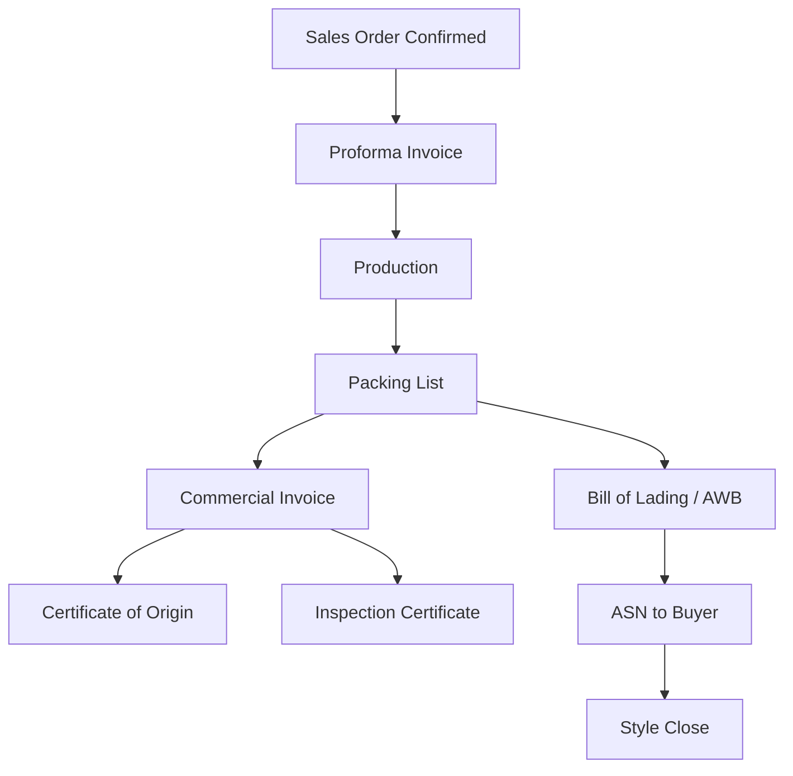

# Commercial Documents Report — GAP Analysis

**Generated:** 2026-08-03

---

## Executive Summary

Kepler'de **ticari doküman modülü yok**. Enterprise layer'da invoice relation stub, attachment engine tip tanımları ve PRD/API spec referansları var; **hiçbir export dokümanı create/issue/lifecycle ile yönetilmiyor**.

---

## Mevcut Durum

| Doküman | Kepler | Konum |
|---------|--------|-------|
| Proforma Invoice | ❌ | — |
| Commercial Invoice | ⚠️ Stub ID | `sales-order-relations.ts` |
| Packing List | ❌ (operational) | Packaging demo ≠ doc |
| Certificate of Origin | ❌ | — |
| Inspection Certificate | ❌ | — |
| Bill of Lading | ❌ | — |
| Air Waybill | ❌ | — |
| ASN | ❌ | — |
| Export Document Bundle | ❌ | — |

**Platform support (partial):**
- `AttachmentEntityType` includes SalesOrder, ProductCard
- `AttachmentFileType`: Teknik Föy, Ölçü Tablosu — production docs, not commercial
- PRD Module 1: Order attachments
- API Spec Module 6: document links on shipment

---

## Dokümanların ERP Lifecycle'daki Yeri

| Aşama | Doküman | SSOT | Kepler |
|-------|---------|------|--------|
| Pre-production | Proforma | Finance/SO | ❌ |
| Pre-ship | Packing List | Logistics | ❌ |
| Ship | B/L, AWB | Logistics | ❌ |
| Export | COO, Inspection Cert | Compliance | ❌ |
| Revenue | Commercial Invoice | Finance | ❌ |
| Buyer EDI | ASN | Integration | ❌ |
| Close gate | All docs Complete | Closing checklist | ❌ |

---

## Tier-1 Document Requirements

| Özellik | SAP F&R / D365 Fashion | Kepler |
|---------|------------------------|--------|
| Document numbering | Series per doc type | ❌ |
| Revision / void | Audit trail | ❌ |
| PDF generation | Template engine | ❌ |
| Weight/qty from PL | SSOT chain | ❌ |
| Incoterm / payment term | SO header | ⚠️ Order form |
| Multi-currency | CI line | ⚠️ Currency field |
| Electronic submission | EDI/API | ❌ |

---

## Öncelik

| ID | Gap | P |
|----|-----|---|
| CD-P0-01 | Commercial Invoice entity + issue | P0 |
| CD-P0-02 | Packing List as commercial doc | P0 |
| CD-P0-03 | B/L + AWB | P0 |
| CD-P1-01 | Proforma Invoice | P1 |
| CD-P1-02 | Certificate of Origin + Inspection | P1 |
| CD-P1-03 | ASN | P1 |
| CD-P2-01 | Export document bundle + e-submission | P2 |

---

## Sonuç

Commercial documents **9/9 doküman tipi eksik** (1 stub). Style close'un **Financial/Document Complete** gate'leri bu modül olmadan çalışamaz.
