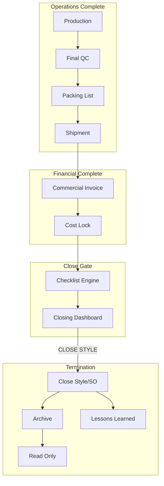

# Final GAP Analysis — Export Closing & Tier-1 Textile ERP

**Generated:** 2026-08-03  
**Scope:** Sections 1–11 comprehensive closing domain analysis  
**Method:** Codebase audit + PRD/DB spec cross-reference + Tier-1 benchmark  
**Code changes:** None

---

## Executive Summary

Kepler ERP **üretim-odaklı textile ERP** olarak güçlü bir temel sunuyor (Execution Platform, persistence constitution, Brain, textile domain). **Export closing domain'i ~5–10% complete** — demo sayfalar ve type stub'ları var; **operasyonel modül, command path ve close orchestration yok**.

| Domain | Completeness | P0 gaps |
|--------|--------------|---------|
| Style Closing | ~5% | 13 |
| Packing List | ~10% | 12 |
| Shipment | ~15% | 9 |
| Commercial Documents | ~0% | 9 |
| Warehouse Closing | ~0% | 7 |
| Cost Closing | ~10% | 6 |
| Claim Management | ~0% | 8 |
| Lessons Learned | ~15% | 6 |
| Archive | ~5% | 5 |
| Closing Dashboard | ~0% | 3 |

**Toplam P0 closing modülü: 10** — hepsi eksik veya stub.

---

## Mevcut Sistem — Ne Var?

### Implemente (kısmen)

| Alan | Kanıt |
|------|-------|
| Production execution | Execution Platform modules |
| Quality inspection UI | `/quality/*` demo |
| Packaging display | `/packaging` carton cards |
| Container planning | `/shipping/containers` |
| Shipping list | `/shipping` mock |
| Cost calculation | `cost-calculator`, costing page |
| Order stage badges | packingStatus, shippingStatus |
| ShipmentCompleted event | `event-bus.ts` |
| Product Card Kapalı status | Type only |
| Forwarder/container MD | master-data lookups |
| PRD Module 6 design | Locked — not wired |

### Eksik (tamamen)

Style close engine, checklist blockers, packing list document, commercial invoice, B/L, FG dispatch, cost lock, claims, archive enforcement, closing dashboard, lessons learned batch.

---

## Modül Özetleri

Detay raporlar:

| # | Rapor | Ana bulgu |
|---|-------|-----------|
| 1 | [STYLE-CLOSING-REPORT.md](./STYLE-CLOSING-REPORT.md) | 15 pre-close kontrol; 0 runtime |
| 2 | [PACKING-LIST-REPORT.md](./PACKING-LIST-REPORT.md) | 14 süreç; 2 partial |
| 3 | [SHIPMENT-MANAGEMENT-REPORT.md](./SHIPMENT-MANAGEMENT-REPORT.md) | PRD M6 vs demo gap |
| 4 | [COMMERCIAL-DOCUMENTS-REPORT.md](./COMMERCIAL-DOCUMENTS-REPORT.md) | 9/9 doc types missing |
| 5 | [WAREHOUSE-CLOSING-REPORT.md](./WAREHOUSE-CLOSING-REPORT.md) | Post-prod WH pipeline absent |
| 6 | [COST-CLOSING-REPORT.md](./COST-CLOSING-REPORT.md) | No plan/actual/lock |
| 7 | [CLAIM-MANAGEMENT-REPORT.md](./CLAIM-MANAGEMENT-REPORT.md) | Zero module |
| 8 | [LESSONS-LEARNED-REPORT.md](./LESSONS-LEARNED-REPORT.md) | Brain live-only |
| 9 | [ARCHIVE-MANAGEMENT-REPORT.md](./ARCHIVE-MANAGEMENT-REPORT.md) | Spec only |
| 10 | [CLOSING-DASHBOARD-REPORT.md](./CLOSING-DASHBOARD-REPORT.md) | Required P0 UX |
| 11 | [TEXTILE-ERP-COMPLETENESS-REPORT.md](./TEXTILE-ERP-COMPLETENESS-REPORT.md) | Tier-1 compare |

---

## Style Close — Pre-Close Checklist (Konsolide)

Style veya Sales Order kapanmadan **hard block** önerilen kontroller:

### Completion gates

1. Production Complete — all PO terminal
2. Final Quality Complete — final AQL pass/waived
3. Packing Complete — packed qty = SO qty
4. Shipment Complete — delivered/closed
5. Commercial Invoice Complete — issued
6. Cost Calculation Complete — actuals posted
7. Margin Calculation Complete — final margin

### Open record gates

8. Open Purchase Order = 0 (or approved exception)
9. Open Production Order = 0
10. Open Quality Issue / Claim = 0
11. Open Warehouse Transaction = 0
12. Open Financial Transaction = 0

### Terminal actions

13. Style Close — status transition
14. Archive — retention tier
15. Read Only — mutation block

---

## End-to-End Closing Architecture (Hedef)

---

## Önerilen Roadmap (Closing Domain)

### Phase 1 — P0 Foundation (Export CMT minimum)

| Sprint | Deliverable |
|--------|-------------|
| C1 | PackingList + Carton aggregate + PL create |
| C2 | ShipmentRecord (PRD M6) + loading plan |
| C3 | Commercial Invoice + B/L |
| C4 | FG warehouse + dispatch |
| C5 | StyleClose checklist engine |
| C6 | Closing Dashboard + CLOSE STYLE/SO |
| C7 | Archive + read-only enforcement |
| C8 | Cost close + lock |

### Phase 2 — P1 Operational maturity

Claims, ASN, COO, lessons learned batch, variances, approvals.

### Phase 3 — P2 Enterprise

EDI, carrier API, WMS RF, cold archive.

**Dependency:** Catalog Completion sprint (Product Card CRUD) should precede style close — close targets real aggregates.

---

## Tier-1 Karşılaştırma Özeti

| Vendor capability | Kepler gap |
|-------------------|------------|
| SAP S/4HANA Fashion season/style close | Full module missing |
| Oracle shipment + export docs | Full module missing |
| Infor M3 dispatch + invoice chain | Full module missing |
| D365 F&O packing + ASN | Full module missing |

Kepler **production floor parity** hedefler; **export office parity** hedeflemiyor — bu analiz o gap'i quantize eder.

---

## Riskler (Closing modülü yapılmazsa)

| Risk | Etki |
|------|------|
| Premature "complete" | SO marked shipped ≠ financially closed |
| Compliance | No B/L/CI audit trail |
| Margin blindness | Demo cost ≠ actual |
| Claim exposure | Post-delivery issues untracked |
| Data corruption | No read-only after close |

---

## Constitution Uyumu

| Kural | Closing modülü |
|-------|----------------|
| Business rules in domain | Checklist engine → domain service |
| TX + outbox | Close command → UoW + events |
| Product Card = SSOT | Style close updates PC.status |
| SO doesn't create PC | Unchanged |
| PRD SSOT | EXF/TNA consume, not duplicate |

---

## P0 / P1 / P2 Master List

### P0 (10 modül)

1. Style Closing Engine  
2. Closing Dashboard  
3. Packing List Management  
4. Shipment Management  
5. Commercial Invoice + B/L  
6. Warehouse FG + Dispatch  
7. Cost Close + Lock  
8. Archive + Read Only  
9. Open-record blockers  
10. Document completion gate  

### P1 (8 modül)

Claims, Proforma, COO/Inspection, ASN, Lessons Learned, PL/Ship revision, Mixed/partial rules, Cost variance approval

### P2 (6 modül)

Carrier API, WMS RF, Label/GS1, Cold archive, PA analytics, Multi-style partial close

---

## Tek Cümlelik Cevap

**Kepler ERP gerçek bir Tier-1 tekstil ERP olmak için Style Closing orchestration, Closing Dashboard, tam Packing List & Shipment Management, Commercial/Export Documents, post-production Warehouse dispatch, Cost Close & Lock, Claim Management, close-triggered Lessons Learned, ve Archive/Read-Only modüllerine ihtiyaç duyuyor.**

---

## Rapor İndeksi

1. [STYLE-CLOSING-REPORT.md](./STYLE-CLOSING-REPORT.md)  
2. [PACKING-LIST-REPORT.md](./PACKING-LIST-REPORT.md)  
3. [SHIPMENT-MANAGEMENT-REPORT.md](./SHIPMENT-MANAGEMENT-REPORT.md)  
4. [COMMERCIAL-DOCUMENTS-REPORT.md](./COMMERCIAL-DOCUMENTS-REPORT.md)  
5. [WAREHOUSE-CLOSING-REPORT.md](./WAREHOUSE-CLOSING-REPORT.md)  
6. [COST-CLOSING-REPORT.md](./COST-CLOSING-REPORT.md)  
7. [CLAIM-MANAGEMENT-REPORT.md](./CLAIM-MANAGEMENT-REPORT.md)  
8. [LESSONS-LEARNED-REPORT.md](./LESSONS-LEARNED-REPORT.md)  
9. [ARCHIVE-MANAGEMENT-REPORT.md](./ARCHIVE-MANAGEMENT-REPORT.md)  
10. [CLOSING-DASHBOARD-REPORT.md](./CLOSING-DASHBOARD-REPORT.md)  
11. [TEXTILE-ERP-COMPLETENESS-REPORT.md](./TEXTILE-ERP-COMPLETENESS-REPORT.md)  
12. **FINAL-GAP-ANALYSIS.md** (bu belge)
